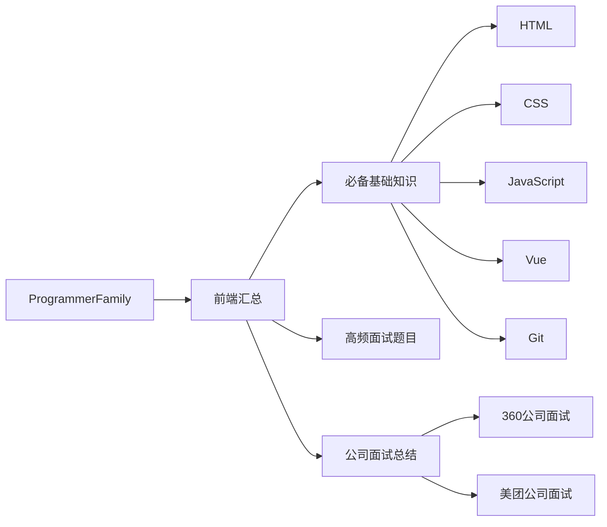

# ProgrammerFamily
开创一个针对于程序员的“永乐大典”！！！

## 知识库结构图

```mermaid
graph LR
	ProgrammerFamily --> 前端汇总
	前端汇总 --> 必备基础知识
	必备基础知识 --> HTML
	必备基础知识 --> CSS
	必备基础知识 --> JavaScript
	必备基础知识 --> Vue
	必备基础知识 --> Git
	前端汇总 --> 高频面试题目
	前端汇总 --> 公司面试总结
	公司面试总结 --> 360公司面试
	公司面试总结 --> 美团公司面试
```

