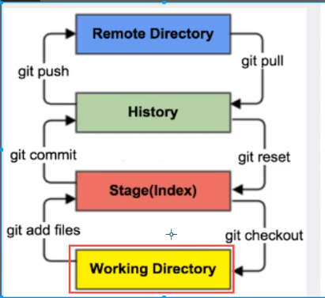
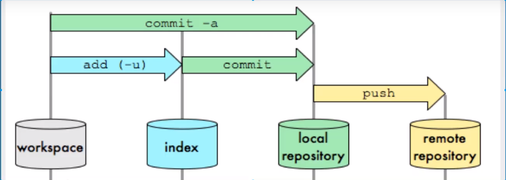
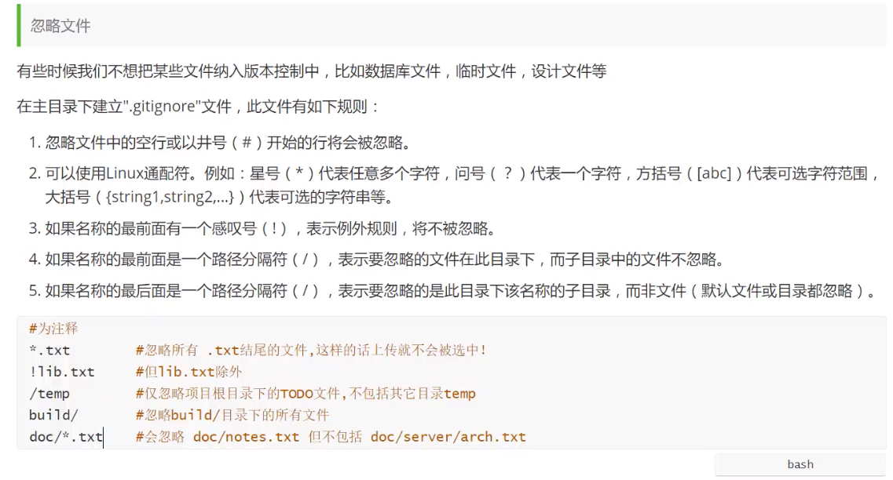

#### git

```
git是一种分布式版本控制工具，我们可以通过它管理我们自己的代码，即便是修改了代码，也能得到这个代码之前的版本。
```

#### git和svn的区别

```
	svn是集中式版本控制系统，版本库集中放在中央服务器上的，而工作的时候，用的都是自己的电脑，需要先从中央服务器得到最新的版本，然后工作，工作完成后，需要把自己做完的任务推送的中央服务器。集中式版本控制系统是必须联网才能工作，对网络带宽要求较高。

	git是分布式版本控制系统，没有中央服务器，每个人的电脑就是一个完整的版本库，工作的时候不需要联网了，因为版本都在自己的电脑上。协同的方法：如果自己在电脑上修改了文件A，其他人在电脑上也修改了文件A，这时，你们两之间只需要将各自的修改推送给对方，就可以互相看到对方的修改了。
```

#### 区域

```
工作区：代码文件的位置；

暂存区：修改代码暂时存放的位置，事实上只是一个文件，保存即将提交的文件列表信息；

本地仓库：安全存放数据的位置，里面有提交的所有版本的数据，HEAD指向最新放入仓库的版本；

远程仓库：码云或者GitHub；托管代码的服务器；
```

#### 常用命令图解






#### git对象(.git文件)

```
objects：存储数据的所有内容；

index：文件保存暂存区信息；
```

#### 常用Linux命令

```powershell
clear——清除屏幕
echo——往控制台打印信息的，相当于console.log()
echo 'demo'>text.txt——将'demo'内容存放在新建的文件text.txt中
ll——读取当前目录下的文件
find 目录名——将对应文件的目录、子文件和子孙文件平铺在控制台
find 目录名 -type f——将对应文件的子文件
rm 文件名——删除文件
mv 源文件 重命名文件——重命名
cat 文件路径——查看文件内容
vim 文件路径——编辑文件内容
	英文状态下，按i进行编辑模式，
	按esc和：键，退出编辑模式
	wq退出并保存
	q!强制退出
touch 新建一个文件
mkdir 新建一个目录（文件夹）
pwd 显示当前目录的路径
```

#### 文件的状态

```
1. Untracked:未跟踪，此文件在文件夹中，但还没有提交到git库，通过git add状态变为Staged；
2. Staged:暂存状态，执行commit将修改同步到库中；
3. Unmodify:文件已经入库，未修改；
4. Modified:文件已经修改；
```

#### 创建远程仓库

```shell
1、申请GitHub账号
2、登录之后，点击右上角的 + ，点击New repository创建新仓库，在新的界面里可以设置仓库的名字等一些配置
3、创建仓库之后，会得到https和SSH链接，这个链接指向远程仓库，一般这个链接很长，所以可以在本地仓库中创建别名，用这个别名代替远程仓库

如果使用的是https链接，每次push文件到远程仓库都需要凭据验证，使用SSH链接可以免密登录，但需要如下的配置
	1、生成一个公钥，这个公钥就可以代替当前的客户端，生成公钥方法：
		ssh-keygen -t rsa -C 邮箱
		接着按回车键三次
	2、将生成的公钥复制下来，然后进入到GitHub的setting目录下，找到左侧的SSH and GPG keys，添加公钥到远程仓库
```

#### 团队协作

```shell
1、登录自己的GitHub账号，进入到远程仓库，点击settings，左侧菜单栏会有Collaborators选项，在Add people中添加想要邀请的团队成员
2、复制Pending invite(邀请函)，本质上是一个链接地址，发送邀请函给成员，等待其同意
```

#### 跨团队协作

```shell
	拿到别人远程仓库的地址，打开远程仓库；点击fork，将别人远程仓库的内容拿到一份放在自己的GitHub中，就可以进行相应功能的修改
```

#### Git高层命令

###### 查看安装的git版本

```powershell
git --version
```

###### 创建本地仓库

```powershell
第一种方法：创建全新的本地仓库
    git init					//初始化仓库
第二种方法：克隆远程仓库
    git clone [url地址]
    这个url地址是码云或者GitHub中点击克隆按钮时出现的url地址；
    克隆代码的操作包括了三种：(1)拉取代码;(2)初始化本地仓库;(3)创建别名,默认创建的别名是origin
```

###### 忽略文件

```
创建.gitignore文件，就不会把所有的文件都纳入版本控制当中；
```



###### 其他Git高层命令

```powershell
git status
确定文件当前处于什么状态
git diff
查看当前做的哪些更新还没有暂存
git diff --cached或者git diff --staged(1.6.1以上)
查看哪些更新已经暂存起来并准备做下次提交
git commit
启动文本编辑器以便输入本次提交的说明
git commit -a
直接跳过暂存区将没有暂存的文件暂存并直接提交
git log --oneline
获取历史信息，按q退出
git rm 文件
将文件删除，并将对象送到暂存区
git mv 
同理，更改完文件名之后将对象送到暂存区
git cat-file -p 哈希名
查看文件的内容
git reflog
记录了每一次提交对象的信息
get add 路径 		//将修改的文件存放在暂存区，有多少个修改的文件暂存区就有多少个对象。
get commit -m "注释内容"    //将暂存区内容提交到本地仓库

注意：文件会分为已跟踪和未跟踪，已跟踪文件又分为已提交、已暂存、已修改状态。
```

###### Git分支操作

```powershell
分支就相当于将原来的项目复制了一份，本质是一个提交对象。
git branch 分支名
创建分支
git checkout 分支名
切换分支
git branch
显示分支列表
git branch -D 分支名
强制删除分支，但是不能自己删自己，要删除的分支已经与master分支合并了，就可以使用-d删除
git branch 分支名 提交对象哈希名
新建一个分支并且指向指定的提交对象
git checkout -b 分支名
创建新的分支并直接切换过去
git merge 分支名
将分支与master分支合并，当前命令在master分支上执行
git branch 分支名 哈希值
创建一个提交对象是指定哈希值的分支，版本穿梭

注意：切换分支的时候要保证当前分支的文件已经暂存并且提交，不然会污染其他分支。所以切分支之前一定要先看一下当前分支的状态。
```

###### 查看暂存区（底层命令）

```powershell
git ls-files -s
```

###### Git存储

```powershell
git stash list
查看当前存储
git stash
将当前修改但是没有提交的文件存储到一个栈中
git stash apply 储藏的名字
应用栈中保存的文件，默认取栈顶的文件
git stash drop 储藏的名字
删除栈中储藏的文件，也是默认取出栈顶的文件
git stash pop
应用栈中的储藏文件并将其删除，上面两个命令的结合，有多个储藏文件时使用上述两个命令
```

###### Git撤销

```powershell
git checkout -- 文件
重置工作目录中文件的修改
git reset HEAD 文件名
重置暂存区的修改
git commit --amend
可以打开本次提交的注释修改页面，更正之后可以自动提交
```

###### 打标签

```powershell
git tag
列出所有的tag标签
git tag 标签
给提交对象打上标签
git show 标签名
可以查看特定标签的提交对象的信息
git tag -d 标签名
删除标签
git checkout -b 标签名
查看某个标签指向的文件版本
```

#### 常用的git操作

###### 将本地项目推送到远程仓库

```powershell
git push 仓库别名 分支名，此时生成了远程分支
```

###### 将远程仓库的项目下载（克隆）到本地的步骤

```powershell
1、新建一个本地文件夹
2、在文件夹中打开git bash页面，使用命令 git clone url地址
```

###### 查看当前的远程仓库

```powershell
git remote -v
```

###### 给本地仓库起别名

```powershell
git remote add 别名 仓库地址（https）
```

###### 全局配置

```powershell
查看系统config配置
git config --system --list
查看当前用户配置
git config --global --list
配置个人用户名和电子邮箱
git config --global user.name “runoob”
git config --global user.email text@runoob.com
```

###### 更新修改远程仓库

```powershell
git fetch 别名（将修改同步到远程跟踪分支上）
git merge 远程跟踪分支
将远程跟踪分支合并到master上
```

###### 正常的数据推送和拉取步骤

1. 确保本地分支已经跟踪了远程跟踪分支

   ```powershell
   git branch -u 远程分支名
   本地分支跟踪远程分支
   ```

2. ```powershell
   将分支推送到远程仓库中
   git push 仓库别名 分支名
   从远程仓库拉取代码
   git pull 仓库别名 分支名  //这个操作将代码拉取下来会自动提交到本地库
   ```

  ###### 本地分支跟踪远程分支的情况

   1. 克隆时，已经自动创建好一个本地分支，并且此本地分支已经自动跟踪了远程分支

   2. 已经有一个创建好的本地分支时

      ```powershell
      git branch -u 远程分支名
      本地分支跟踪远程分支
      ```

   3. 新建一个分支时，并且跟踪其他远程分支

      ```powershell
      git checkout -b 本地分支名 远程跟踪分支名
      或git checkout --track 远程跟踪分支名
      ```

###### 冲突合并

```powershell
合并分支时，两个分支在同一个文件的同一个位置有两套完全不同的修改。

首先使用git merge进行合并发现不会成功；
然后可以打开合并冲突的文件（代码）手动选择保留哪一个分支的版本，再进行提交；
```

###### 版本穿梭

```powershell
git remote -v
查看之前提交的版本号
git reset --hard 版本号
回退到指定版本
注意：在进行版本穿梭操作的时候，最好新建一个分支，因为回退到远程仓库的主分支之前的分支，再push到远程仓库会出现错误
```

